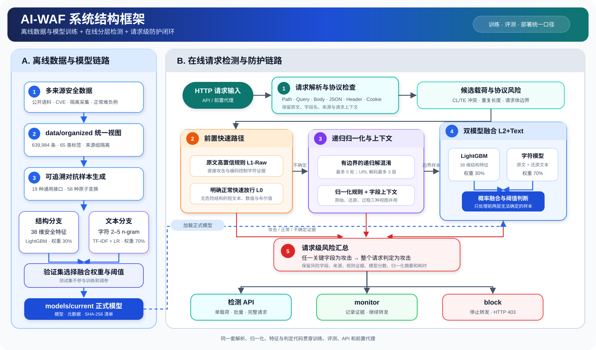

# AI-WAF--面向混淆逃逸的 Web 攻击动态检测、训练、评测与部署系统

> **2026第二届大学生人工智能安全竞赛作品赛一等奖作品**

| 指导老师 | 队长 | 队员 |
|---|---|---|
| 杨望 | 杨钟垚 | 刘赛阁、段傲铧、陈彦博 |

AI-WAF 是一套面向混淆逃逸的 AI 增强型 Web 应用防火墙。系统从完整 HTTP 请求中提取路径、查询参数、请求体、请求头和 Cookie 等候选载荷，通过有边界的递归归一化还原多层编码与结构变形，再结合高置信规则、38 维结构特征 LightGBM 模型和字符 n-gram 文本模型形成请求级判定，并由检测 API 或前置代理执行监控、转发和阻断。

项目同时提供完整数据集、可追溯混淆样本生成、模型训练、独立评测、真实 WAF 对比、可视化实验平台和服务器最小部署包。

- [完整作品报告：AI-WAF_report.pdf](docs/AI-WAF_report.pdf)
- [项目文档索引](docs/README.md)
- [系统设计](docs/SYSTEM_DESIGN.md)
- [完整实验流程](docs/FULL_WORKFLOW.md)
- [服务器接入说明](docs/deployment/SERVER_INTEGRATION.md)

## 核心能力

- 多视图还原：同时保留原始载荷、逐层归一化结果和处理过程特征，覆盖 URL/HTML/Unicode/Base64 编码、注释插入、字符拆分、路径变形等混淆。
- 分层检测：明确攻击由规则快速识别，明确正常输入走快速放行路径，边界样本再进入 LightGBM 与字符模型融合。
- 请求级判断：自动解析查询参数、路径、JSON、表单、请求头和 Cookie，定位风险字段并汇总为完整请求结论。
- 在线防护：提供 FastAPI 检测服务、monitor/block 前置代理、故障开放/关闭策略、JSONL 审计日志和运维控制台。
- 完整实验闭环：统一完成数据组织、混淆生成、训练、独立测试、组件消融和三款真实 WAF 产品对比。

## 系统结构框架



[查看系统结构原图](docs/assets/system-architecture.svg)

在线与离线链路共用解析、归一化、特征提取和判定代码，避免训练、评测与部署之间出现处理口径不一致。

## 实验结果

### 正式独立测试

报告使用 34,721 条未参与训练和调参的字段级记录，其中包含 32,196 条正常记录、1,168 条原始攻击和 1,357 条混淆攻击。

| 指标 | 结果 |
|---|---:|
| Precision | 99.0476% |
| Recall | 98.8515% |
| F1 | 98.9495% |
| 正常流量误报率 | 0.0745% |
| 原始攻击召回率 | 98.8014% |
| 混淆攻击召回率 | 98.8946% |
| 载荷级平均延迟 | 0.7933 ms |
| 载荷级 P99 | 1.8383 ms |
| 吞吐量 | 1,260.481 records/s |

混淆矩阵为 TN=32,172、FP=24、FN=29、TP=2,496。混淆攻击召回率与原始攻击召回率基本一致，说明编码嵌套、注释插入、大小写扰动和字符串拆分没有造成明显性能下降。

### 组件消融实验

组件实验使用 9,500 条流量，其中正常流量占 89.4737%。完整链路让 95% 的流量在前置路径完成判断，只把边界样本交给双模型。

| 方案 | Precision | Recall | F1 | FPR | 混淆攻击召回率 | P95/ms | P99/ms |
|---|---:|---:|---:|---:|---:|---:|---:|
| 仅规则 | 94.4915% | 22.3000% | 36.0841% | 0.1529% | 2.0755% | 0.0444 | 0.0885 |
| 规则＋归一化 | 78.8494% | 46.6000% | 58.5795% | 1.4706% | 45.0943% | 0.1386 | 0.2401 |
| 仅 LightGBM | 99.6976% | 98.9000% | 99.2972% | 0.0353% | 99.2453% | 0.5245 | 0.7002 |
| 仅字符模型 | 98.8060% | 99.3000% | 99.0524% | 0.1412% | 99.6226% | 0.9931 | 1.3609 |
| 双模型融合 | 99.5988% | 99.3000% | 99.4492% | 0.0471% | 99.4340% | 1.3639 | 1.7405 |
| 完整链路 | 98.9022% | 99.1000% | 99.0010% | 0.1294% | 99.0566% | 0.6537 | 1.2704 |

相较始终执行双模型，完整链路的 P95 降低约 52.1%，P99 降低约 27.0%，在检测质量仅小幅变化的情况下显著减少常态请求开销。

### 与真实 WAF 产品对比

下表采用竞赛作品报告的定稿实验数据。AI-WAF、ModSecurity + OWASP CRS、open-appsec 和 SafeLine 均处理相同的 34,721 条记录。三个对比对象均以固定版本的真实反向代理产品运行，只有产品明确阻断且后端未收到请求时才计为检出；5xx、超时和连接异常不计为成功。

| 系统 | 版本 | Precision | Recall | F1 | FPR | 接入 P99/ms |
|---|---|---:|---:|---:|---:|---:|
| **AI-WAF** | 当前正式链路 | **99.0476%** | **98.8515%** | **98.9495%** | **0.0745%** | **2.2567** |
| ModSecurity + OWASP CRS | 3.0.16 + 4.28.0 | 40.1990% | 52.7921% | 45.6429% | 6.1592% | 3.9064 |
| open-appsec | 1.1.35-open-source | 29.9154% | 77.0693% | 43.1008% | 14.1601% | 27.5188 |
| SafeLine CE | 9.3.11 | 92.4107% | 57.3861% | 70.8038% | 0.3696% | 16.2656 |

接入 P99 包含反向代理、HTTP 传输和后端到达证明；1.8383 ms 的载荷级 P99 只包含进程内预处理与推理，两种时间口径不能直接互换。完整方法、版本身份和公平性说明见 [作品报告](docs/AI-WAF_report.pdf) 与 [WAF 对比文档](docs/experiments/REAL_WAF_COMPARISON.md)。

## 数据集

数据来自公开安全语料、CVE 关联信息与利用样例、隔离环境采集、项目生成数据、正常业务难负例和混淆派生数据。`data/organized` 是训练与评测使用的唯一统一数据入口，其他数据目录用于保存来源、许可证、生成脚本和重建依据。

| 数据范围 | 正常样本 | 攻击样本 | 合计 |
|---|---:|---:|---:|
| 完整统一数据视图 | 509,811 | 130,173 | 639,984 |
| 字段模型训练集 | 256,856 | 25,569 | 282,425 |
| 字段模型验证集 | 32,228 | 2,214 | 34,442 |
| 字段模型测试集 | 32,196 | 2,525 | 34,721 |

- 统一数据视图覆盖 65 个标签类别；字段模型训练范围覆盖 23 种攻击类型，正式测试覆盖其中 22 种。
- 项目记录 58 种原子混淆变换，其中 19 种封装为通用生成接口。
- 2,260 条攻击原型派生出 9,040 条类型专项混淆样本，并保留来源组、变换链和固定随机种子。
- 当前交付的 `data/organized` 包含 725 个数据文件，约 1.31 GB；大型 JSONL 文件由 Git LFS 管理。
- 数据按来源、采集批次、CVE、模板家族和样本组切分，同一原始攻击及其变体不会跨训练集与测试集。

## 项目目录

```text
AI-WAF/
├─ run.py                  训练、评测、服务和部署统一入口
├─ src/                    请求解析、归一化、规则、模型管线、API 与代理
├─ payload_generator/      19 种通用混淆载荷生成接口
├─ training/               数据审计、模型训练、独立评测和 WAF 对比
├─ experiments/ablation/   六组组件消融实验、结果和图表
├─ data/organized/         训练与评测使用的完整统一数据视图
├─ models/current/         正式模型、模型清单和实验报告
├─ demo/                   本地实验可视化前端
├─ deployment/             最小运行包、Docker、服务器和产品基准配置
├─ tests/                  单元、集成、代理、数据与交付验收测试
├─ tools/                  模型清单、交付验证和维护脚本
└─ docs/                   作品报告、系统、数据、实验与部署文档
```

## 快速开始

### 1. 获取项目与数据

项目包含大体积 Git LFS 数据，克隆前请先安装 [Git LFS](https://git-lfs.com/)。

```bash
git lfs install
git clone https://github.com/X-Yzy/AI-WAF.git
cd AI-WAF
git lfs pull
```

### 2. 创建 Python 环境

推荐 Python 3.12 或更高版本。

```bash
python -m venv .venv

# Windows PowerShell
.venv\Scripts\Activate.ps1

# Linux / macOS
source .venv/bin/activate

python -m pip install --upgrade pip
python -m pip install -r requirements.txt
```

### 3. 快速验证并启动实验界面

```bash
python run.py smoke
python run.py ui
```

浏览器访问 `http://127.0.0.1:8000`。需要允许其他主机访问时，可执行：

```bash
python run.py ui --host 0.0.0.0 --port 8000
```

本地实验界面用于数据、混淆、归一化、检测、训练和评测展示；生产运维控制台由服务器运行包提供。

## 启动实验

| 任务 | 命令 | Docker |
|---|---|---|
| 自动化测试 | `python run.py test` | 不需要 |
| 正式模型独立评测 | `python run.py evaluate` | 不需要 |
| 重新训练模型 | `python run.py train --min-recall 0.95` | 不需要 |
| 六组组件消融 | `python experiments/ablation/run_ablation_study.py` | 不需要 |
| 三款真实 WAF 同集对比 | `python run.py compare-waf` | 必须 |
| 训练、测试、评测和 WAF 对比完整流程 | `python run.py all --min-recall 0.95` | 必须 |

`compare-waf` 和 `all` 会启动固定版本的 ModSecurity、open-appsec 与 SafeLine。运行前必须确认 `docker version` 和 `docker compose version` 正常；SafeLine 首次配置还需要本机安装 Edge 或 Chrome。流程不会用关键词模拟器代替真实产品，也不会把未完成的部分结果发布为正式报告。

## 快速部署到服务器

推荐导出只包含检测核心、正式模型和部署配置的最小运行包。训练数据、实验界面、生成器和测试不会进入服务器包。

### 1. 在开发机生成运行包

```bash
python run.py build-runtime
python deployment/server_runtime/verify_manifest.py
```

将整个 `deployment/server_runtime/` 上传到服务器。

### 2. 在 Linux 服务器启动

假设原业务只监听 `http://127.0.0.1:3000`：

```bash
cd server_runtime
cp .env.example .env
```

编辑 `.env`，至少确认以下配置：

```dotenv
WAD_PROXY_BACKEND=http://127.0.0.1:3000
WAD_PROXY_BIND=0.0.0.0
WAD_PROXY_PORT=8081
WAD_PROXY_MODE=monitor
WAD_PROXY_FAIL_POLICY=closed
WAD_DASHBOARD_PASSWORD=替换为强随机密码
```

启动并检查服务：

```bash
docker compose up -d --build
docker compose ps
curl http://127.0.0.1:8081/_wad/health
curl http://127.0.0.1:8081/
```

推荐拓扑：

```text
用户 / 负载均衡 / Nginx TLS
              |
              v
AI-WAF 前置代理 :8081  ---->  原业务 :3000
        |
        ├─ monitor：记录攻击并继续转发
        └─ block：攻击请求返回 HTTP 403
```

首次接入应保持 `monitor`，覆盖登录、搜索、上传和管理操作并观察 `runtime/proxy_access.jsonl`；确认误报可接受后，将 `.env` 中的 `WAD_PROXY_MODE` 改为 `block`，再执行：

```bash
docker compose up -d --force-recreate proxy
```

生产环境应让原业务只监听内网或回环地址，避免绕过 AI-WAF；TLS 建议由现有负载均衡、Nginx、Apache 或 IIS 终止。详细拓扑、模板和上线检查见 [现有服务器快速接入](docs/deployment/SERVER_INTEGRATION.md)。

## 在线接口

| 接口 | 方法 | 作用 |
|---|---|---|
| `/health` | GET | 检查服务与正式模型加载状态 |
| `/detect` | POST | 检测单条载荷 |
| `/batch-detect` | POST | 批量检测，单次最多 100 条 |
| `/detect-http` | POST | 解析并检测完整 HTTP 请求 |
| `/stats` | GET | 查询进程内检测统计 |
| `/stats/reset` | POST | 重置统计 |
| `/_wad/health` | GET | 检查前置代理和上游状态 |

## 文档

- [AI-WAF_report.pdf：48 页完整作品报告](docs/AI-WAF_report.pdf)
- [文档索引](docs/README.md)
- [检测核心](docs/components/DETECTION_CORE.md)
- [数据集说明](docs/data/DATASET_GUIDE.md)
- [模型说明](docs/MODEL.md)
- [测试报告](docs/TEST_REPORT.md)
- [消融实验](docs/experiments/ABLATION_STUDY.md)
- [真实 WAF 对比](docs/experiments/REAL_WAF_COMPARISON.md)
- [服务器运行包](docs/deployment/SERVER_RUNTIME.md)
- [服务器接入](docs/deployment/SERVER_INTEGRATION.md)

## 项目验收

```bash
python -m pytest -q
python tools/verify_delivery.py
```

验收会检查核心代码、完整数据、正式模型、部署文件、测试和文档，并校验数据规模、模型清单与 SHA-256。

## 致谢

感谢指导老师杨望在项目方向、系统设计与作品完善过程中的指导。感谢刘赛阁、段傲铧、陈彦博在项目实现、实验验证、报告整理和比赛准备过程中的共同投入与支持。

## 安全说明

本项目用于 Web 防护、教学研究和经授权的安全测试。载荷生成与真实 WAF 对比应在自有、授权或隔离环境中执行，请勿用于未授权目标。AI-WAF 是纵深防御组件，不能替代参数化查询、输出编码、最小权限和安全开发流程。
